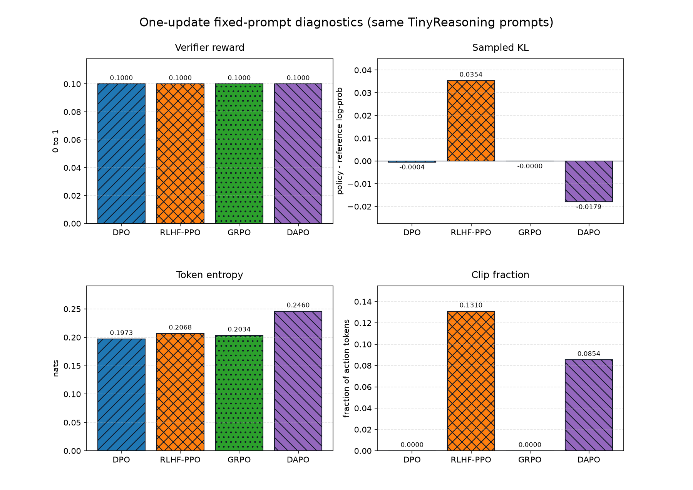
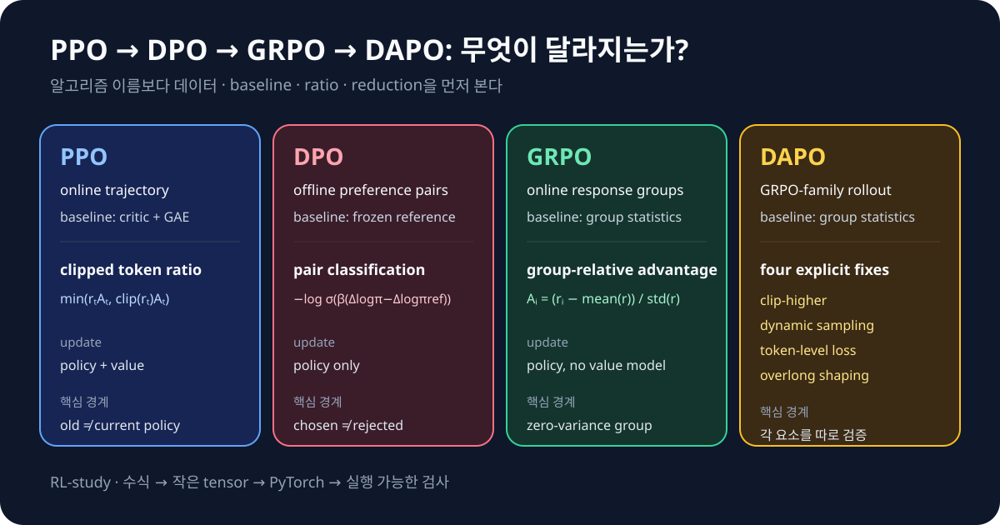

# RL-study

**English** · [한국어](README.md)

[](https://github.com/BangProx/RL-study/actions/workflows/ci.yml)
[](pyproject.toml)
[](LICENSE)

**Do not stop at reading about reinforcement learning for LLMs.** Connect PPO,
RLHF, DPO, GRPO, DAPO, and Agentic RL from equations to small PyTorch
implementations and real optimizer updates—on CPU, without an external API.

> **Start here → [L00 · The LLM RL Map](notebooks/en/L00_rl_map.ipynb)**

This self-contained course is for developers and researchers who know basic Python
and tensors, are new to RL or post-training, and learn best through short sections
with immediate executable feedback. To try the repository without local setup, open
the [free Colab quickstart](notebooks/colab/RL_study_quickstart.ipynb).

## What You Will Be Able to Do

- Derive and implement learning targets from Bellman backups to PPO clipping.
- Identify exactly which LLM tokens are policy actions and which must be masked.
- Separate the old, reference, reward, value, and trainable policies in RLHF-PPO.
- Explain how DPO, GRPO, and DAPO change data, baselines, ratios, and reductions.
- Implement action masks and outcome/process credit for multi-turn tool trajectories.
- Train, resume, and evaluate toy runs before scaling to laptop and server profiles.

## See a Real Result First

This is not a hand-drawn mockup. `python -m rl_study.demo` produced the figure after
one real CPU update each for DPO, RLHF-PPO, GRPO, and DAPO on the same fixed
TinyReasoning prompts.



One toy update is not a paper-scale result or an algorithm ranking. The figure shows
that reward, KL, entropy, and clipping are computed by working training paths with
different semantics. Regenerate it with `python scripts/render_readme_asset.py`.

## 15-Minute Quickstart

Python 3.10–3.12 and a CPU are enough. No model or API download is used by the default
toy demo.

```bash
python -m venv .venv
.venv/bin/pip install -e '.[dev]'
.venv/bin/python -m rl_study.demo \
  --profile toy --non-interactive --output-dir artifacts/demo --json
```

On Windows, use `.venv\Scripts\python`. Every run creates a new directory containing
machine-readable metrics, a PNG comparison, static and interactive HTML reports,
five checkpoints, and experiment cards.

## Pick a Course Path

| Path | Content | Estimated study time |
|---|---|---:|
| Fast | `[CORE]` sections in the 13 starred lessons | 369 minutes, about 6 hours |
| Full | All L00–L16 sections, recall prompts, and mistake checks | 845 minutes, about 14 hours |

The estimate includes reading, prediction, hand calculations, and exercises—not code
runtime. Open the [English course map](docs/course-map.en.md) for all 17 lessons.

## Compare the Objectives in One Screen



The repository covers classic RL foundations, RLHF-PPO, DPO, GRPO, DAPO, RLOO,
Dr. GRPO, GSPO, and offline Agentic RL environments. Start implementation details
from the [algorithm cards](docs/algorithms/cards.md).

## Scale Beyond Toy Code

The [laptop and server guide](docs/profiles/laptop-server.md) separates an audited
small public-model LoRA path from distributed recipes whose GPU results have not been
executed locally. Downloads over the configured threshold require explicit approval.

## Reproducibility Boundary

Toy runs validate equations, tensor shapes, gradients, masks, and training lifecycle.
They do not reproduce paper-scale benchmarks or rank algorithms. See
[known limitations](docs/known-limitations.md), [provenance](docs/provenance.md), and
the [research evidence index](docs/research/README.md).

New repository code and documentation are Apache-2.0. See [NOTICE](NOTICE) for
third-party boundaries, [CONTRIBUTING.md](CONTRIBUTING.md) to contribute, and
[CITATION.cff](CITATION.cff) to cite the project.
