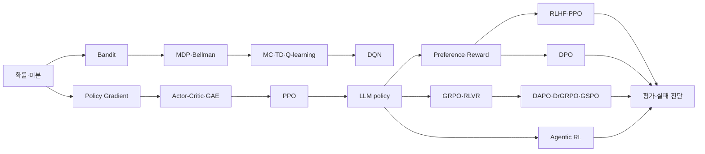

# C2 강좌 설계

> 설계 버전: 1.0
> 고정일: 2026-08-19
> 대상: Python과 기본 tensor 연산을 아는 RL 초심자

## 학습 약속

강좌는 “먼저 지도를 보고 → 작은 숫자로 직접 계산하고 → 같은 수식을 코드로
검산하고 → LLM 규모의 의미로 확장”하는 한 방향으로 진행한다. 각 lesson은
25~60분, 각 micro-section은 5~8분이다. 빠른 경로는 ★ section만 따라가며
4~6시간, 전체 경로는 11~14시간을 목표로 한다. 이 시간은 C10 전체 notebook을
깨끗이 실행한 측정값으로 교정하기 전까지 **설계 추정값**이다.

초심자가 매 lesson에서 답할 질문은 세 가지뿐이다.

1. 지금 최적화하는 확률은 무엇인가?
2. reward가 어느 action/token의 gradient에 영향을 주는가?
3. 안정성을 위해 무엇을 고정·mask·clip·normalize했는가?

## 전체 개념 지도



색을 보지 못해도 같은 관계를 읽을 수 있는 ASCII fallback:

```text
확률·미분 → bandit → MDP/Bellman → MC/TD/Q-learning → DQN
     └────→ policy gradient → actor-critic/GAE → PPO
                                      └→ LLM policy + preference/reward
                                           ├→ RLHF-PPO
                                           ├→ DPO
                                           ├→ GRPO/RLVR → DAPO/DrGRPO/GSPO
                                           └→ Agentic RL
모든 경로 ───────────────────────────────────→ 평가·실패 진단
```

## 17개 lesson 계약

`source ID`는 [`docs/sources.yml`](../sources.yml)의 `id`와 일치한다. 각
notebook은 아래 objective를 최대 세 개로 유지하고, demo와 실행 가능한 exercise를
반드시 포함한다.

### L00 — 15분에 보는 LLM RL 전체 지도 (25분, ★)

- 선수지식: Python 실행 경험
- 목표: agent/environment/reward를 한 문장으로 구분한다; 전체 지형에서
  PPO·DPO·GRPO·Agentic RL의 위치를 찾는다; 작은 policy curve를 해석한다.
- demo: 2-action bandit policy의 확률과 평균 reward가 20 update 동안 변하는 표
- exercise/check: update 전후 좋은 action 확률이 증가하는지 예측하고 assert
- sources: `sutton-barto-rl2`, `ppo-2017`, `dpo-2023`,
  `deepseekmath-grpo-2024`, `agent-lightning-2025`

### L01 — 확률·미분·PyTorch 생존 키트 (40분, ★)

- 선수지식: L00, 기본 Python
- 목표: log-prob/entropy/KL을 계산한다; expectation gradient의 직관을 말한다;
  detach와 gradient 흐름을 확인한다.
- demo: 3-class categorical의 entropy·forward/reverse KL·autograd 손계산 parity
- exercise/check: REINFORCE loss 부호를 일부러 뒤집고 gradient 방향 assert
- sources: `sutton-barto-rl2`

### L02 — 언어모델은 어떻게 확률을 내는가 (45분)

- 선수지식: L01
- 목표: causal next-token objective를 설명한다; token/sequence log-prob shape을
  추적한다; prompt/pad/response mask를 구분한다.
- demo: `tiny-v1`의 logits `[B,T,V]`에서 response log-prob만 합산
- exercise/check: prompt mask를 잘못 포함한 loss와 올바른 loss의 차이 assert
- sources: `instructgpt-2022`

### L03 — 가장 작은 RL: bandit (35분, ★)

- 선수지식: L01
- 목표: exploration/exploitation을 구분한다; regret를 계산한다; sample reward로
  policy를 update한다.
- demo: epsilon-greedy와 softmax policy의 5-arm 누적 regret 비교
- exercise/check: 같은 seed에서 epsilon=0의 실패 case 재현
- sources: `sutton-barto-rl2`

### L04 — MDP와 Bellman equation (50분, ★)

- 선수지식: L03
- 목표: state/action/transition/reward를 정의한다; Bellman backup을 손계산한다;
  policy/value iteration 차이를 확인한다.
- demo: 4×4 TinyGridWorld value heatmap과 greedy path
- exercise/check: terminal state에서 bootstrap이 0인지 assert
- sources: `sutton-barto-rl2`

### L05 — 경험으로 배우기: MC·TD·Q-learning (50분)

- 선수지식: L04
- 목표: MC와 TD target을 비교한다; on/off-policy 차이를 찾는다; truncation과
  termination을 나눈다.
- demo: 동일 trajectory에서 MC·TD(0)·Q-learning target 표
- exercise/check: terminal mask가 빠진 고의 버그를 analytic value로 탐지
- sources: `sutton-barto-rl2`

### L06 — DQN과 function approximation (50분)

- 선수지식: L05, `nn.Module`
- 목표: replay와 target network의 역할을 설명한다; target gradient를 끊는다;
  instability ablation을 읽는다.
- demo: TinyGridWorld DQN의 target sync on/off loss·success 비교
- exercise/check: target parameter gradient가 모두 `None`인지 assert
- sources: `dqn-2013`

### L07 — Policy Gradient와 REINFORCE (50분, ★)

- 선수지식: L01, L03
- 목표: log-derivative trick을 코드로 잇는다; reward-to-go를 계산한다; baseline이
  variance를 줄이는 이유를 관찰한다.
- demo: 같은 bandit/short MDP의 baseline 유무 gradient variance
- exercise/check: advantage detach 유무의 gradient ownership 비교
- sources: `sutton-barto-rl2`

### L08 — Actor-Critic·GAE·PPO from scratch (60분, ★)

- 선수지식: L05, L07
- 목표: critic과 GAE를 계산한다; old/current ratio를 구분한다; clip objective의
  positive/negative advantage case를 검산한다.
- demo: analytic trajectory GAE → TinyGridWorld mini PPO train
- exercise/check: ratio 1·clip 경계·lambda 0/1 parity assert
- sources: `gae-2015`, `ppo-2017`, `repo-spinningup`

### L09 — LLM을 policy로 보기 (50분, ★)

- 선수지식: L02, L08
- 목표: token을 action으로 해석한다; preference와 scalar/verifiable reward를
  구분한다; reference KL이 필요한 이유를 설명한다.
- demo: 한 prompt의 response token별 policy/reference log-ratio와 reward 분해
- exercise/check: EOS 이후와 prompt token이 policy loss에서 빠지는지 assert
- sources: `learning-to-summarize-2020`, `instructgpt-2022`

### L10 — RLHF-PPO end-to-end (60분, ★)

- 선수지식: L08, L09
- 목표: SFT→preference→RM→rollout→PPO update 흐름을 실행한다; 네 모델의
  gradient 소유권을 구분한다; reward와 KL을 진단한다.
- demo: TinyReasoning SFT/RM/RLHF-PPO train과 response 비교
- exercise/check: frozen reference/reward parameter hash 불변 assert
- sources: `learning-to-summarize-2020`, `instructgpt-2022`,
  `repo-summarize-from-feedback`

### L11 — DPO: RL 없이 보이는 RL 목적함수 (50분, ★)

- 선수지식: L09
- 목표: chosen/rejected log-ratio를 손계산한다; beta를 해석한다; online RL과
  다른 점을 설명한다.
- demo: 같은 TinyReasoning preference로 SFT와 DPO response/implicit reward 비교
- exercise/check: pair ordering을 바꾸면 loss가 어떻게 변하는지 assert
- sources: `dpo-2023`, `repo-dpo`

### L12 — GRPO와 verifiable reward (55분, ★)

- 선수지식: L08, L09
- 목표: group-relative advantage를 구한다; critic 제거 trade-off를 말한다;
  zero-variance/length bias를 진단한다.
- demo: prompt당 4 completion의 reward·advantage·token loss 표
- exercise/check: all-equal reward group에서 NaN 없이 zero advantage assert
- 심화: RLOO leave-one-out baseline 비교
- sources: `deepseekmath-grpo-2024`, `rloo-2024`, `repo-deepseek-math`

### L13 — DAPO와 안정적인 reasoning RL (55분, ★)

- 선수지식: L12
- 목표: DAPO 네 요소를 독립 toggle한다; Dr. GRPO length correction을 비교한다;
  GSPO sequence ratio를 token ratio와 구분한다.
- demo: Clip-Higher/Dynamic Sampling/token loss/overlong shaping 2×2 핵심 ablation
- exercise/check: positive·negative advantage asymmetric clip과 dynamic filter assert
- sources: `dapo-2025`, `dr-grpo-2025`, `gspo-2025`,
  `repo-understand-r1-zero`, `framework-verl`
- license note: `repo-dapo` 코드·문서·asset은 사용하지 않는다.

### L14 — 실제 소형 모델 학습과 서버 확장 (55분)

- 선수지식: L10~L13 중 하나, config/CLI 기초
- 목표: download/preflight 결과를 읽는다; SmolLM2 LoRA one-step을 선택적으로
  실행한다; 같은 실험을 verl server recipe로 옮기는 경계를 안다.
- demo: offline preflight → 사용자 승인 시 pinned model/dataset one-step
- exercise/check: `--accept-download` 없는 100MB+ 요청이 network 전에 실패
- sources: `framework-trl`, `framework-verl`, `framework-openrlhf`

### L15 — Agentic RL: tool을 쓰며 여러 turn 학습하기 (60분, ★)

- 선수지식: L08, L09
- 목표: single response와 step-level MDP를 구분한다; tool/environment token을
  mask한다; outcome/process credit를 비교한다.
- demo: CalculatorToolEnv와 LocalLookupEnv trajectory 수집·update
- exercise/check: invalid call/timeout/termination과 retokenization drift assert
- 심화: ALFWorld text adapter preflight/external-manual 경로
- sources: `agent-lightning-2025`, `agent-r1-2025`,
  `framework-agent-lightning`, `repo-agent-r1`, `benchmark-alfworld`

### L16 — 실패 진단·평가·capstone (55분, ★)

- 선수지식: L10~L15
- 목표: reward hacking/length bias/KL explosion/entropy collapse를 metric으로
  찾는다; 공정 비교 조건을 audit한다; 결과와 논문 수치를 분리해 보고한다.
- demo: 동일 initial hash/data/budget의 PPO·DPO·GRPO·DAPO artifact 비교 report
- exercise/check: 오염된 split·다른 token budget·stale checkpoint를 checker가 거부
- sources: 모든 이전 lesson source와 `docs/sources.yml`

## 빠른 경로

`L00 → L01 → L03 → L04 → L07 → L08 → L09 → L10 → L11 → L12 → L13 →
L15 → L16`의 ★ section을 따른다. L02·L05·L06·L14의 핵심 요약은 해당 다음
lesson의 prerequisite check에서 제공하지만, full path에서는 생략하지 않는다.

빠른 경로도 구현 cell을 건너뛰는 “슬라이드 코스”가 아니다. 각 lesson에서 최소
한 번 예측하고 한 번 실행하고 한 번 assertion을 통과해야 한다.

## 공통 toy 규모

2026-08-19 M4 host, macOS 26.5.1 arm64, Python 3.10.12, PyTorch 2.13.0 CPU에서
[`scripts/benchmark_toy_sizes.py`](https://github.com/BangProx/RL-study/blob/main/scripts/benchmark_toy_sizes.py)를 3회
warm-up 뒤 20회 측정했다.

| preset | shape | params | CPU median step | CPU p95 | 역할 |
|---|---|---:|---:|---:|---|
| `tiny-micro-v1` | V64/T32/D32/H4/L2/FF64, B16 | 20,224 | 3.081ms | 3.388ms | unit/smoke |
| `tiny-base-v1` | V96/T64/D64/H4/L2/FF128, B16 | 77,312 | 6.430ms | 6.991ms | 작은 시각화 |
| `tiny-v1` | V128/T64/D96/H4/L3/FF192, B16 | 242,976 | 9.598ms | 10.809ms | notebook/demo canonical |

`tiny-v1`의 100 update는 이 synthetic next-token benchmark에서 중앙값 기준 약
0.96초다. rollout, Python environment, evaluation과 report 시간은 포함하지
않으므로 전체 train 시간을 이 숫자로 주장하지 않는다. 현재 runtime은 MPS가
built이지만 `is_available=False`였으므로 MPS 성능 숫자는 기록하지 않았다.

고정 dataset 크기:

- TinyReasoning: train 256 / validation 64 / test 128 prompt, preference 512 pair
- group RL: prompt당 기본 4 completion, 최대 response 32 token
- Bandit: 5 arms, 기본 500 interaction
- TinyGridWorld: 4×4, 최대 32 step/episode
- CalculatorToolEnv·LocalLookupEnv: 각각 train 128 / validation 32 / test 64 task,
  최대 6 agent step

모든 split은 seed 42와 generator version으로 만들고 ID/hash를 저장한다. 공식
test에 해당하는 toy test split도 training이나 early stopping에 사용하지 않는다.

## C10에서 교정할 값

- 실제 notebook clean execution wall time와 peak RSS
- 빠른/전체 경로의 읽기·exercise 예상 시간
- demo 전체 runtime과 artifact 크기
- macOS/Linux/Windows CPU 편차

설계 추정과 25% 이상 차이가 나면 lesson 수를 늘리기보다 micro-section과 기본
step 수를 조정하고 변경 이유를 `PROGRESS.md`에 남긴다.
